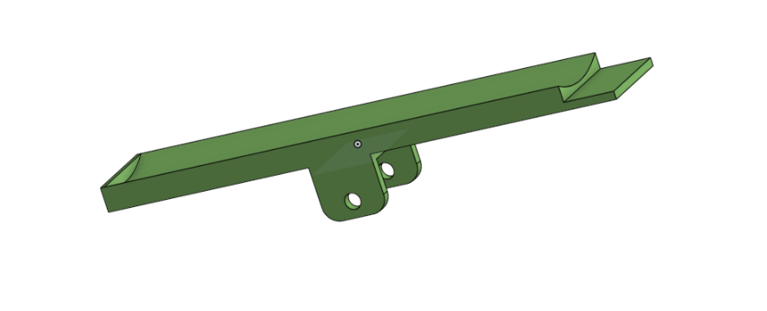
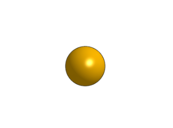
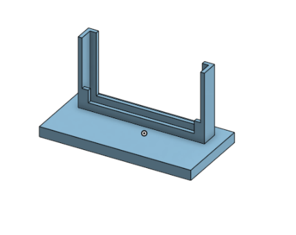
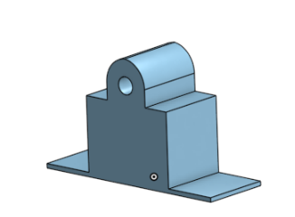
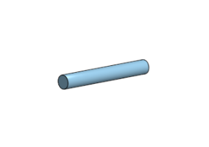
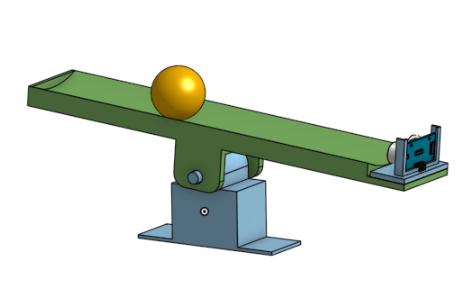

# PID Balance-bot
## Description
This project uses PID control to tilt a platform in order to keep a ball in the center even with outside forces moving the ball. PID control reads the data and if there is an error it works it out back to normal, in this project there will be a ball on a beam with a set position so it can balance, if the ball moves from the it's position the beam will reset it. Thorugh coding with Python and PID, disigning,and wiring we will reach our final project, the Balance Bot.
## Evidence
[Our planning document](https://docs.google.com/document/d/1fVeS6Nz3x-aw5kM-pLlMPw-Nbu9bjymMA8uOpB1ZbKA/edit?usp=sharing)


## Onshape Rough Draft

After the Research, we had to put together a rough draft of what our project would look like.

[Onshape rough draft](https://cvilleschools.onshape.com/documents/6021407610dea9eef68c77cb/w/05ab5f2c8939c789ea2dda76/e/d3010f2dd1c4c5ebb5aa311d)


First, we started with the platform which would hold our ball, but we had to see which design would work better in the whole project. After, 3 designs we came up with the the platform final idea whose picture is shown on bottom left. But, then we had to make modifications to it in order for it to attach to the beam and the Ultrasonic Sensor to be a part of it which led us to the platform shown at the bottom right.

            

After the platform came our other parts which included the ball, the distance sensor holder, the beam, and the pin.

            

            

Then we put evertyhing together into our Rough Draft Assembly.

 

Obstacles in this process: The Ball, Pin, Beam and the Distance Sensor Holder were pretty easy to design. Our platform had been our hardest due to the many changes and designs it had gone through, but this was still our rough draft so we weren't finished. Once we had our assembly, Mr. H had given us idea to try to incorporate the servo in the middle of the balance bot, basically taking the place of the pin attaching the beam and the platform. After some days of processing and planning how that would work we realized it would actually be a lot harder to do it that way, and decided instead to go with the servo attached to the side of the platform with a joint, and idea we got from some of the videos in our [planning document](https://docs.google.com/document/d/1fVeS6Nz3x-aw5kM-pLlMPw-Nbu9bjymMA8uOpB1ZbKA/edit?usp=sharing) except Mr. H thought we could make the joint simpler with only connecting at two points instead of three like the videos. Then we encountered another problem ( yet again, but this is what brainstorming is about), since we wanted to 3D print the platform it had to be shorter then 9 inches in length because the biggest printer could only print that, but our platform was about a foot in length. With this change we had to figure out how we could manage with a shorter platform since the ball had to have enough distance to move and the platfrom also needed space for the distance sensor which would cut back our length even more.

## Pseudo Code
```python
// have a set position
// error or an if moved from position it brings it back
// input & output
// distance
// 

import board
import neopixel
import time
import servo
from adafruit_hcsr04 import HCSR04
pip install simple-pid
from simple_pid import PID
sonar = adafruit_hcsr04.HCSR


```
## Reflection
We learned what a PID is and how to use it. A PID Works by giving it a set goal and then an input and the PID will change the output by a percentage. Then it will compare to the goal and if it has not met the goal then it will move the output by the percentage. This repeats really fast until the goal and input match.  
