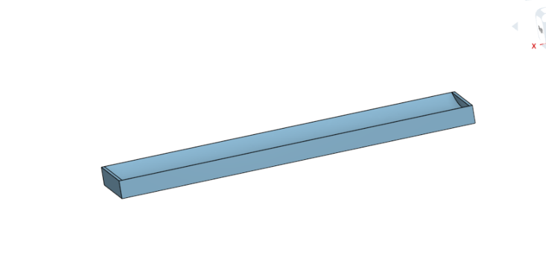

# PID Balance-bot
## Description
This project uses PID control to tilt a platform in order to keep a ball in the center even with outside forces moving the ball. PID control reads the data and if there is an error it works it out back to normal, in this project there will be a ball on a beam with a set position so it can balance, if the ball moves from the it's position the beam will reset it. Thorugh coding with Python and PID, disigning,and wiring we will reach our final project, the Balance Bot.
## Evidence
[Our planning document](https://docs.google.com/document/d/1fVeS6Nz3x-aw5kM-pLlMPw-Nbu9bjymMA8uOpB1ZbKA/edit?usp=sharing)


## Onshape Rough Draft

After the Research, we had to put together a rough draft of what our project would look like.



First, we started with the beam which would hold our ball, but we had to see which design would work better in the whole project. After, 3 designs we came up with the The Beam whose picture is shown on top. But' then we had to make modifications to it in order for the Ultrasonic Sensor to be a part of it which led us to the Beam below.


[Onshape rough draft](https://cvilleschools.onshape.com/documents/6021407610dea9eef68c77cb/w/05ab5f2c8939c789ea2dda76/e/d3010f2dd1c4c5ebb5aa311d)

## Pseudo Code
```python
// have a set position
// error or an if moved from position it brings it back
// input & output
// distance
// 

import board
import neopixel
import time
import servo
from adafruit_hcsr04 import HCSR04
pip install simple-pid
from simple_pid import PID
sonar = adafruit_hcsr04.HCSR


```
## Reflection
We learned what a PID is and how to use it. A PID Works by giving it a set goal and then an input and the PID will change the output by a percentage. Then it will compare to the goal and if it has not met the goal then it will move the output by the percentage. This repeats really fast until the goal and input match.  
